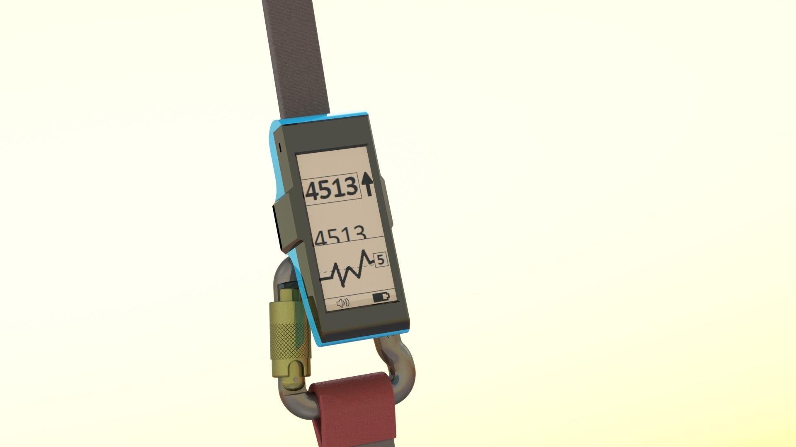
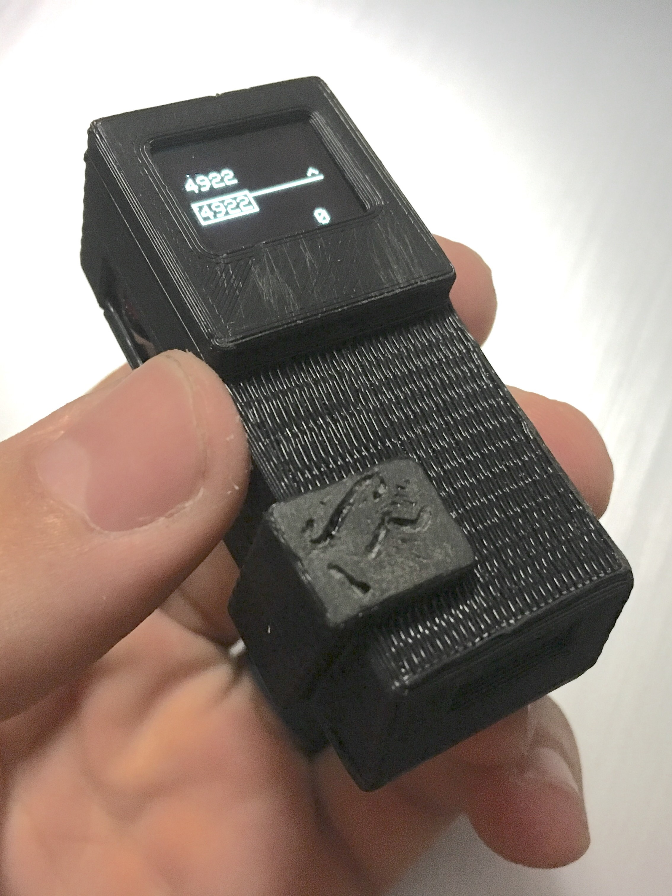
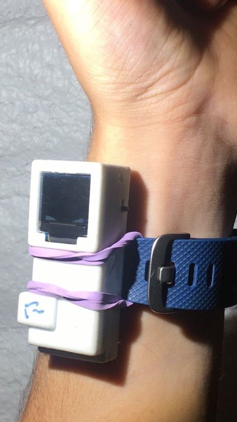
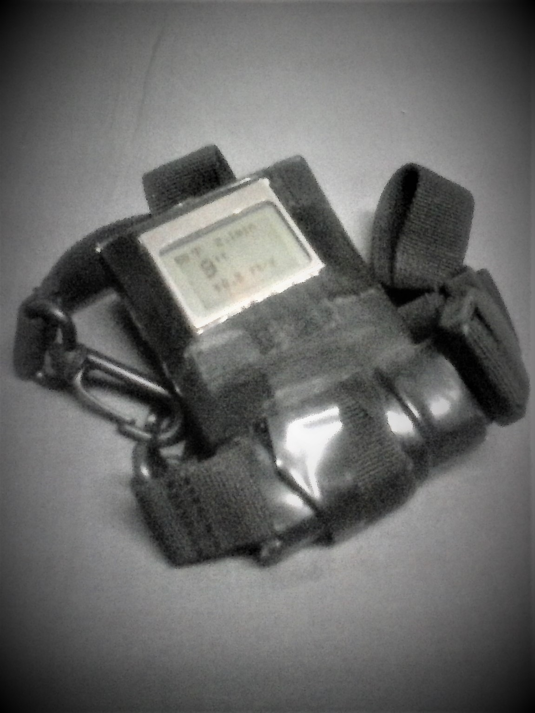

# v^SPEED VARIO
OPEN SOURCE Paragliding Variometer  
(Vertical Speed Indicator)  
  

## PROTOTYPE4: (In Progress)  

  
PROTOTYPE3 (left), PROTOTYPE4 (right)  

### IMPROVEMENTS:  
- Bluetooth compatible with:  
  -iPhone: Flyskyhy  
  -Android: v^Speed (soon to be published)   
- 2.9" e-Paper display is much larger  
- Electromagnetic amplified buzzer is much louder  
- Micro SD saves settings and any desired flight data  
- Single Button power-on also used for interfacing with menu  
- Machine assembly potential: All SMD components, except the switch  
- Size: 100x21x40mm
- Material cost for ten: $69 each  
- Material cost for one: $111 each  

 

# PREVIOUS VERSIONS --

## PROTOTYPE3:  

   

### Features:  
- 60x20x28mm (perfect for wrist watch, or riser mounting)  
- Adafruit Feather Bluefruit M0  
- MS5611 Barometric Pressure/Temperature Sensor (SPI mode)  
- Less than several INCHES of altitude noise with a simple averaging filter  
- 20 Altitude samples per second with the display screen ON  
- 50 Altitude samples per second while connected to your phone with the display screen OFF  
- 0.66" OLED display (SPI mode)  
- PS1740 Piezo Buzzer  
- 3D Printed Case  
- Custom designed PCB  
- Bluetooth compatible with:  
  -iPhone: Flyskyhy  
  -Android: v^Speed (not published yet)   
- Audio and a handful of widgets are implemented in each app  
- Material cost for ten: $45 each  
- Material cost for one: $77 each  

### PROTOTYPE2:  

     

- Adafruit Feather Bluefruit 32u4
- MS5611 Barometric Pressure/Temperature Sensor (SPI mode)
- Material cost for ten: $45 each
- Material cost for one: $77 each     

### PROTOTYPE1: (Obviously one of a kind)  

### Features:  
- Arduino Nano  
- BMP180 Barometric Pressure/Temperature Sensor (I2C mode)  
- Material cost for one: $20  

## ADDITIONAL INFORMATION:  
### Footage:  
Introduction: https://www.youtube.com/watch?v=gFNgn0X94sw  
In-Flight Test: https://www.youtube.com/watch?v=RXyAx8dpHaY  

The only footage I have for the app is during an Imagine Dragons concert in a low averaging setting--   
Android App: https://www.youtube.com/watch?v=2kcBOBjCzPE&t=4s  
(At about 1:20 the heavy base ramps up during the song and makes the barometric sensor data go nuts!)  

## WANT ONE?
Contact: vSpeedVario@gmail.com

#### This is an open-source project 
...found on GitHub ( https://github.com/glydrfreak )
Be careful not to get too involved, because it may just eat away your whole entire Summer, prohibit you from sleeping all night, and even may cause you to actually study everything about electronics. More extreme side effects may include forgetting to eat, resulting in very serious hunger pains. 

##### Android App--
I have modified Adafruit's "Bluefruit LE Connect" for Android only so far, and the source code can be found in the Android folder. Just plop it into Android Studio and upload it to your Android device. I have not published anything to Google Play yet.
Adafruit's "Bluefruit LE Connect" (without my modifications) is available as an alternative to download on your mobile device from Google Play and the App Store, and will work in UART mode, via sending characters between the Feather Bluefruit M0 and your mobile device.  

##### 3D Printing--
Printing the cases for each variometer should be quite a bit cheaper now that my dad purchased a Prusa i3 MK3 3D printer. SOLIDWORKS is my software of choice, but if it's not available for you, I would suggest OnShape.com for designing your 3D printed parts.

##### Arduino IDE--
The Arduino integrated development environment (IDE) is the free software and programming language compatible with this device. Paul McWhorter got me hooked on his YouTube video series of lessons for learning Arduino. Before the summer of 2017, I had no interest in electronics, until I realized you can do almost anything when you combine it with computer programming. I ended up pulling an all nighter as I watched every single one of those videos, and suddenly I knew how electronics worked, and I knew how to implement my own ideas in the Arduino Software. 

##### Custom PCB--
A Custom PCB is designed in the free Eagle CAD software and ordered through SEEED Studios. 

##### Other Materials--
Everything I've purchased throughout the duration of this project can be found in the BillOfMaterials folder in this repository. You can also find lists of where to find the parts for the most recent prototype.

##### Where Did I Learn All This?--
Besides the fact that I've been teaching myself all this stuff, 
HUGE bragging rights within this project can be claimed by: 
Paul Butler ( my Dad ) 
Paul McWhorter ( http://toptechboy.com ) 
Adafruit Industries ( https://www.adafruit.com/ ) 
Sparkfun Electronics ( https://www.sparkfun.com/ ) 
BlueFlyVario ( http://blueflyvario.blogspot.com.au/ ) 

All necessary files can be found in this repository, but feel free to dig through my un-organized version of the entire project at https://drive.google.com/open?id=0B610ABpCama_UF9jZ3pDQzFWTkE

