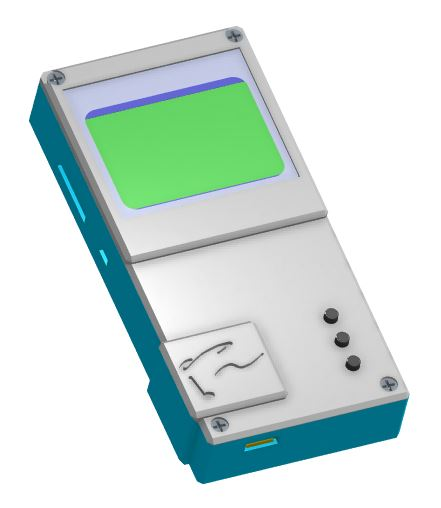
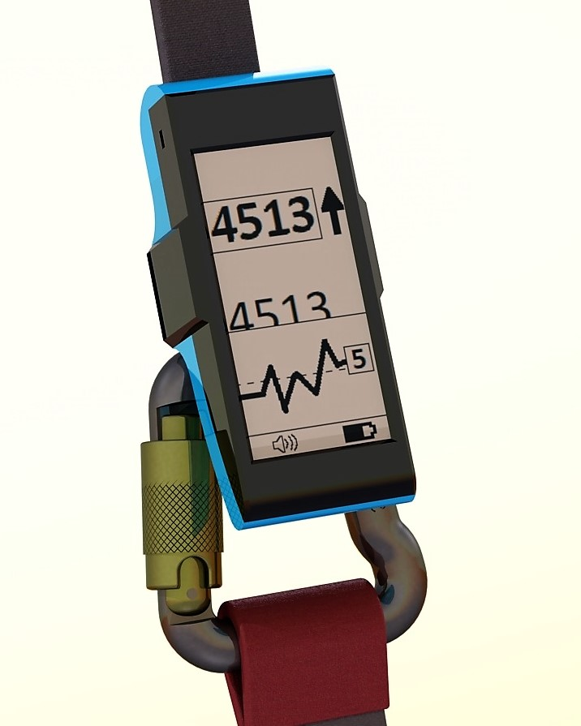
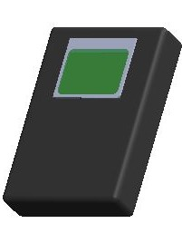
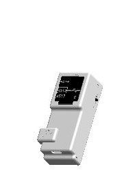
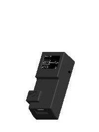
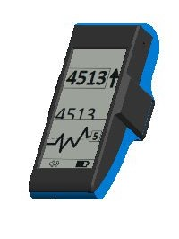
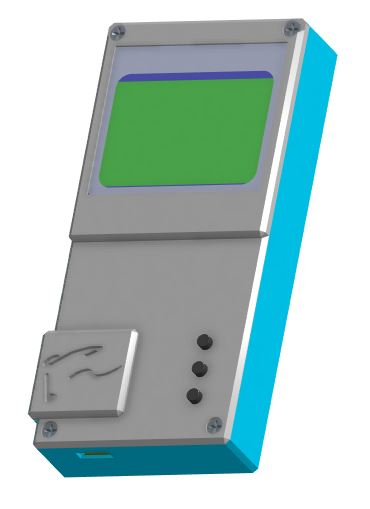
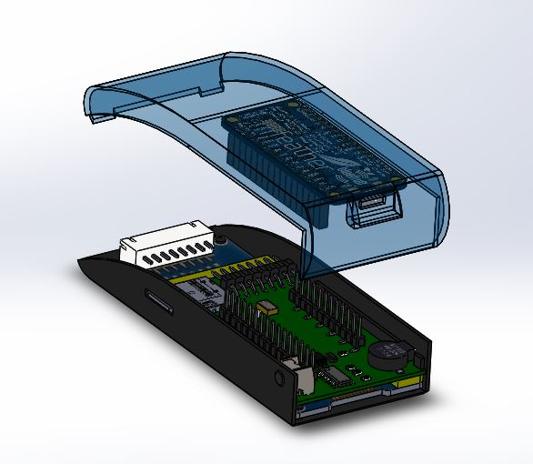

<table float="center">
  <tr>
    <td align="center" width=50%>
      <h1>v^Speed Vario</h1>
      Contents: 
      <a href="#prototype4">PROTOTYPE4</a> 
      <a href="#compare">Compare</a>  
      <a href="#vspeed">Android App</a> 
      <a href="#flyskyhy">iPhone App</a>  
      <a href="#solidworks">3D Printing</a>  
      <a href="#arduino-ide">Arduino Code</a>  
      <a href="#eagle-cad">Custom Circuit Board</a>  
      <a href="#bill-of-materials">Parts List</a>  
    </td>
    <td align="center"> 
      <h3>DIY Paragliding Variometer</h3>
       
      <h6>(Vertical Speed Indicator)</h6>
    </td>
  </tr>
</table>

<table>
  <tr>
    <td width=33% vAlign="top" align="center">
      <h2>PROTOTYPE5</h2>
      <h4>(In Progress)</h4>
      
      <a href="#vspeed-vario">Back to Top</a>  
    </td>
    <td width=66%> 
      <ul>
        <h3>IMPROVEMENTS:</h3>
        <li>Nokia 5110 LCD is much cheaper</li>
        <li>2.9" e-Paper display was having interference issues</li>
        <li>Three buttons used for interfacing with menu</li>
        <li>Screw-together 3D printed case is much more printer friendly</li>
        <li>Size: ?x?x?mm</li>
        <li>Material cost for ten: $? each</li>
        <li>Material cost for one: $? each</li>
      </ul>
    </td>
  </tr>
</table>

<table>
  <tr>
    <td width=33% vAlign="top" align="center">
      <h2>PROTOTYPE4</h2>
      <h4>(on hold)</h4>
      
      <a href="#vspeed-vario">Back to Top</a>  
    </td>
    <td width=66%> 
      <ul>
        <h3>IMPROVEMENTS:</h3>
        <li>Bluetooth compatible with:</li>
        <ul>
          <li>iPhone: Flyskyhy</li>
          <li>Android: v^Speed (soon to be published)</li>
        </ul>
        <li>2.9" e-Paper display is much larger</li>
        <li>Amplified electromagnetic buzzer is much louder</li>
        <li>Micro SD saves settings and any desired flight data</li>
        <li>Single Button power-on also used for interfacing with menu</li>
        <li>Machine assembly potential: All SMD components, except the switch</li>
        <li>Size: 100x40x30mm</li>
        <li>Material cost for ten: $69 each</li>
        <li>Material cost for one: $111 each</li>
      </ul>
    </td>
  </tr>
</table>

<table>
  <tr>
    <td width=33% align="center" vAlign="top">
      <h2>PROTOTYPE3</h2>
       
      <a href="#vspeed-vario">Back to Top</a>  
    </td>
    <td width=66%> 
      <ul>
        <h3>IMPROVEMENTS:</h3>
        <li>Bluetooth compatible with:</li>
        <ul>
          <li>iPhone: Flyskyhy</li>
          <li>Android: v^SPEED (soon to be published)</li>
        </ul>
        <li>Adafruit Feather Bluefruit M0</li>
        <li>MS5611 Barometric Pressure/Temperature Sensor (SPI mode) </li>
        <li>Less than several INCHES of altitude noise with a simple averaging filter</li>
        <li>37 Altitude samples per second with the display screen ON</li>
        <li>56 Altitude samples per second while connected to your phone with the display screen OFF</li>
        <li>Size: 60x28x20mm (perfect for wrist watch, or riser mounting)</li>
        <li>0.66" OLED display (SPI mode)</li>
        <li>PS1740 Piezo Buzzer</li>
        <li>3D Printed Case</li>
        <li>Custom designed PCB</li>
        <li>Audio and a handful of widgets are implemented in each app</li>
        <li>Material cost for ten: $45 each</li>
        <li>Material cost for one: $77 each</li>
      </ul>
    </td>
  </tr>
</table>

<table>
  <tr>
    <td width=33% align="center" vAlign="top">
      <h2>PROTOTYPE2</h2>
       
      <a href="#vspeed-vario">Back to Top</a>  
    </td>
    <td width=66%> 
      <ul>
        <h3>IMPROVEMENTS:</h3>
        <li>Bluetooth compatible with:</li>
        <ul>
          <li>iPhone: (Not yet compatible) </li>
          <li>Android: v^SPEED (soon to be published)</li>
        </ul>
        <li>Adafruit Feather Bluefruit 32u4</li>
        <li>MS5611 Barometric Pressure/Temperature Sensor (SPI mode) </li>
        <li>Less than several INCHES of altitude noise with a simple averaging filter</li>
        <li>21 Altitude samples per second with the display screen ON</li>
        <li>49 Altitude samples per second while connected to your phone with the display screen OFF</li>
        <li>Size: 60x20x28mm (perfect for wrist watch, or riser mounting)</li>
        <li>0.66" OLED display (SPI mode)</li>
        <li>PS1740 Piezo Buzzer</li>
        <li>3D Printed Case</li>
        <li>Custom designed PCB</li>
        <li>Audio and a handful of widgets are implemented in the  v^SPEED app</li>
        <li>Material cost for ten: $45 each</li>
        <li>Material cost for one: $77 each</li>
      </ul>
    </td>
  </tr>
</table>
    

<table>
  <tr>
    <td width=33% align="center" vAlign="top">
      <h2>PROTOTYPE1</h2>
      
      <a href="#vspeed-vario">Back to Top</a>  
    </td>
    <td width=66%> 
      <ul>
        <h3>SPECIFICATIONS:</h3>
        <li>Arduino Nano</li>
        <li>BMP180 Barometric Pressure/Temperature Sensor (I2C mode)</li>
        <li>Just about a foot of altitude noise with a simple averaging filter</li>
        <li>13 Altitude samples per second</li>
        <li>Size: 60x20x28mm (perfect for wrist watch, or riser mounting)</li>
        <li>NOKIA5110 LCD Display (SPI mode)</li>
        <li>Backlight Control</li>
        <li>Volume Control</li>
        <li>PS1240 Piezo Buzzer</li>
        <li>Material cost for one: $20</li>
      </ul>
    </td>
  </tr>
</table>

<table border="1" align="center" >
  <tr> 
    <td VAlign="bottom"> 
      <h3>COMPARE:</h3> 
      <a href="#vspeed-vario">Back to Top</a>  
       
    </td>
    <td width="20%" align="center"> 	</td>
    <td width="20%" align="center"> 	</td>	
    <td width="20%" align="center"> 	</td>
    <td width="20%" align="center"> 	</td>
    <td width="20%" align="center"> 	</td>
  </tr>
  <tr> 
    <td align="center"> <b>Model</b> </td>
    <td align="center"> <b>PROTOTYPE1</b>	</td>
    <td align="center"> <b>PROTOTYPE2</b>	</td>	
    <td align="center"> <b>PROTOTYPE3</b>	</td>
    <td align="center"> <b>PROTOTYPE4</b>	</td>
    <td align="center"> <b>PROTOTYPE5</b>	</td>
  </tr>
  <tr> 
    <td align="center"> <b>Height x Width x Thickness (mm)</b>	 </td>
    <td align="center"> 100 x 70 x 20		</td>
    <td align="center"> 	60 x 28 x 20	</td>	
    <td align="center">  60 x 28 x 20	</td>
    <td align="center"> 100 x 40 x 30	</td>
    <td align="center"> 97 x 47 x 18	</td>
  </tr>
  <tr> 
    <td align="center"> <b>Controller</b>	 </td>
    <td align="center"> Arduino Nano		</td>
    <td align="center"> Bluefruit Feather 32u4	</td>	
    <td align="center"> Bluefruit Feather M0	</td>
    <td align="center"> Bluefruit Feather M0	</td>
    <td align="center"> Bluefruit Feather M0	</td>
  </tr>
  <tr> 
    <td align="center"> <b>Barometer</b>	 </td>
    <td align="center"> BMP180		</td>
    <td align="center"> MS5611	</td>	
    <td align="center"> MS5611	</td>
    <td align="center"> MS5611	</td>
    <td align="center"> MS5611	</td>
  </tr>
  <tr> 
    <td align="center"> <b>Altitude Sample Rate (Hz)</b>	 </td>
    <td align="center"> 13		</td>
    <td align="center"> 21-49	</td>	
    <td align="center"> 37-56	</td>
    <td align="center"> (Not Tested Yet)	</td>
    <td align="center"> ~ 60 </td>
  </tr>  
  <tr> 
    <td align="center"> <b>Altitude Precision (cm)</b> </td>
    <td align="center"> 35		</td>
    <td align="center"> 11	</td>	
    <td align="center"> 10	</td>
    <td align="center"> (Not Tested Yet)	</td>
    <td align="center"> 10	</td>
  </tr>  
  <tr> 
    <td align="center"> <b>Android App Compatibility</b> </td>
    <td align="center"> -		</td>
    <td align="center"> v^SPEED	</td>	
    <td align="center"> v^SPEED	</td>
    <td align="center"> v^SPEED	</td>
    <td align="center"> v^SPEED	</td>
  </tr> 
  <tr> 
    <td align="center"> <b>iPhone App Compatibility</b> </td>
    <td align="center"> - </td>
    <td align="center"> -	</td>	
    <td align="center"> Flyskyhy	</td>
    <td align="center"> Flyskyhy	</td>
    <td align="center"> Flyskyhy	</td>
  </tr> 
  <tr> 
    <td align="center"> <b>Battery</b> </td>
    <td align="center"> 9V </td>
    <td align="center"> BTG 150 mAh Li-Po 3.7V	</td>	
    <td align="center"> BTG 150 mAh Li-Po 3.7V	</td>
    <td align="center"> BTG 150 mAh Li-Po 3.7V	</td>
    <td align="center"> BTG 150 mAh Li-Po 3.7V	</td>
  </tr> 
  <tr> 
    <td align="center"> <b>Battery Life w/ Full Function</b> </td>
    <td align="center"> (Hasn't Died Yet) </td>
    <td align="center"> (Approx 8 hr)	</td>	
    <td align="center"> (Approx 8 hr)	</td>
    <td align="center"> (Not Tested Yet)	</td>
    <td align="center"> (Not Tested Yet)	</td>
  </tr> 
  <tr> 
    <td align="center"> <b>Buzzer</b> </td>
    <td align="center"> PS1240 </td>
    <td align="center"> PS1740	</td>	
    <td align="center"> PS1740	</td>
    <td align="center"> BOT-03D-BUJEON	</td>
    <td align="center"> BOT-03D-BUJEON	</td>
  </tr> 
  <tr> 
    <td align="center"> <b>Amplification</b> </td>
    <td align="center"> - </td>
    <td align="center"> - </td>	
    <td align="center"> -	</td>
    <td align="center"> Yes	</td>
    <td align="center"> Yes	</td>
  </tr> 
  <tr> 
    <td align="center"> <b>Volume Control</b> </td>
    <td align="center"> Thumbwheel </td>
    <td align="center"> Thumbwheel	</td>	
    <td align="center"> Thumbwheel	</td>
    <td align="center"> Digital	</td>
    <td align="center"> Digital	</td>
  </tr> 
  <tr> 
    <td align="center"> <b>Display</b> </td>
    <td align="center"> Nokia5110 LCD </td>
    <td align="center"> 0.66" OLED	</td>	
    <td align="center"> 0.66" OLED	</td>
    <td align="center"> 2.9" e-Paper	</td>
    <td align="center"> Nokia5110 LCD </td>
  </tr> 
  <tr> 
    <td align="center"> <b>Micro SD Slot</b> </td>
    <td align="center"> - </td>
    <td align="center"> -	</td>	
    <td align="center"> -	</td>
    <td align="center"> Yes	</td>
    <td align="center"> Yes	</td>
  </tr> 
  <tr> 
    <td align="center"> <b>User Control</b> </td>
    <td align="center"> Volume, Brightness, Power </td>
    <td align="center"> Volume, Power	</td>	
    <td align="center"> Volume, Power	</td>
    <td align="center"> Single Button	</td>
    <td align="center"> Three Button, Power	</td>
  </tr> 
  <tr> 
    <td align="center"> <b>User Interface</b> </td>
    <td align="center"> - </td>
    <td align="center"> -	</td>	
    <td align="center"> -	</td>
    <td align="center"> Settings Menu	</td>
    <td align="center"> Settings Menu	</td>
  </tr> 
  <tr> 
    <td align="center"> <b>Mounting</b> </td>
    <td align="center"> Leg Strap </td>
    <td align="center"> Riser, Wrist	</td>	
    <td align="center"> Riser, Wrist	</td>
    <td align="center"> Riser	</td>
    <td align="center"> Leg Strap, Riser </td>
  </tr> 
  <tr> 
    <td align="center"> <b>Assembly</b> </td>
    <td align="center"> Cardboard, Protoboard, Wire </td>
    <td align="center"> Custom PCB Through-hole </td>    
    <td align="center"> Custom PCB Through-hole </td>
    <td align="center"> Custom PCB Surface Mount </td>  
    <td align="center"> Custom PCB Surface Mount </td>  
  </tr> 
  <tr> 
    <td align="center"> <b>Qty 10 Unit Material Cost (USD)</b> </td>
    <td align="center"> $20 </td>
    <td align="center"> $45 </td>    
    <td align="center"> $45 </td>
    <td align="center"> $69 </td>  
    <td align="center"> $? </td> 
  </tr> 
  <tr> 
    <td align="center"> <b>Qty 1 Unit Material Cost (USD)</b> </td>
    <td align="center"> $20 </td>
    <td align="center"> $77 </td>    
    <td align="center"> $77 </td>
    <td align="center"> $111 </td> 
    <td align="center"> $? </td> 
  </tr> 
</table>

<table>
  <tr>
    <td width=33% vAlign="top" align="center">
      <h2>v^SPEED</h2>
      
      <a href="#vspeed-vario">Back to Top</a>  
    </td>
    <td width="66%"> 
      <ul>
        <h3>Android App--</h3>
        I have modified Adafruit's "Bluefruit LE Connect" for Android only so far, and the source code can be found in the Android folder. Just plop it into Android Studio and upload it to your Android device. I have not published anything to Google Play yet.
Adafruit's "Bluefruit LE Connect" (without my modifications) is available as an alternative to download on your mobile device from Google Play and the App Store, and will work in UART mode, via sending characters between the Feather Bluefruit M0 and your mobile device.
      </ul>
    </td>
  </tr>
</table>

<table>
  <tr>
    <td width=33% vAlign="top" align="center">
      <h2>Flyskyhy</h2>
      
      <a href="#vspeed-vario">Back to Top</a>  
    </td>
    <td width=66%> 
      <ul>
        <h3>iOS App by Renevision--</h3>
        I've been working with Rene to get v^SPEED VARIO compatible with the World's most popular Paragliding app! He's been very helpful throughout the process, and Flyskyhy is an unbeatable iPhone application when it comes to flying. v^Speed Vario is currently using the same protocol as SkyDrop variometers, so in the app when selecting your device, you must choose SkyDrop for the time being.  
      </ul>
    </td>
  </tr>
</table>

## ADDITIONAL INFORMATION:  
### Footage:  
Introduction: https://www.youtube.com/watch?v=gFNgn0X94sw  
In-Flight Test: https://www.youtube.com/watch?v=RXyAx8dpHaY  

The only footage I have for the app is during an Imagine Dragons concert in a low averaging setting--   
Android App: https://www.youtube.com/watch?v=2kcBOBjCzPE&t=4s  
(At about 1:20 the heavy base ramps up during the song and makes the barometric sensor data go nuts!)  

## WANT ONE?
Contact: vSpeedVario@gmail.com

#### This is an open-source project 
...found on GitHub ( https://github.com/glydrfreak )
Be careful not to get too involved, because it may just eat away your whole entire Summer, prohibit you from sleeping all night, and even may cause you to actually study everything about electronics. More extreme side effects may include forgetting to eat, resulting in very serious hunger pains. 

<table>
  <tr>
    <td width=33% vAlign="top" align="center">
      <h2>SolidWorks</h2>
      
      <a href="#vspeed-vario">Back to Top</a>  
    </td>
    <td width="66%"> 
      <ul>
        <h3>3D Printing--</h3>
        Printing the cases for each variometer should be quite a bit cheaper now that my dad purchased a Prusa i3 MK3 3D printer. SOLIDWORKS is my software of choice, but if it's not available for you, I would suggest OnShape.com for designing your 3D printed parts.
      </ul>
    </td>
  </tr>
</table>

 
<table>
  <tr>
    <td width=33% vAlign="top" align="center">
      <h2>Arduino IDE</h2>
      
      <a href="#vspeed-vario">Back to Top</a>  
    </td>
    <td width="66%"> 
      <ul>
        <h3>Programing Code--</h3>
        The Arduino integrated development environment (IDE) is the free software and programming language compatible with this device. Paul McWhorter got me hooked on his YouTube video series of lessons for learning Arduino. Before the summer of 2017, I had no interest in electronics, until I realized you can do almost anything when you combine it with computer programming. I ended up pulling an all nighter as I watched every single one of those videos, and suddenly I knew how electronics worked, and I knew how to implement my own ideas in the Arduino Software. 
      </ul>
    </td>
  </tr>
</table>

<table>
  <tr>
    <td width=33% vAlign="top" align="center">
      <h2>Eagle CAD</h2>
      
      <a href="#vspeed-vario">Back to Top</a>  
    </td>
    <td width="66%"> 
      <ul>
        <h3>Custom PCB--</h3>
        A Custom PCB is designed in the free Eagle CAD software and ordered through SEEED Studios. 
      </ul>
    </td>
  </tr>
</table>

<table>
  <tr>
    <td width=33% vAlign="top" align="center">
      <h2>Bill of Materials</h2>
      
      <a href="#vspeed-vario">Back to Top</a>  
    </td>
    <td width="66%"> 
      <ul>
        <h3>Full Parts List--</h3>
        <a href="https://github.com/glydrfreak/vSpeedVario/blob/master/BillOfMaterials/INVENTORY.xlsx?raw=true">Download Excel Parts List</a> 
        A list of where to find the parts for the most recent prototype can be found in the table below, or in the BillOfMaterials folder in this repository. 
      </ul>
    </td>
  </tr>
</table>
<table>
  <tr> <td>Designator</td> 				<td>Manufacturer Part Number</td> 															<td>REQUIRED QTY</td> 	<td>DESCRIPTION</td> 		<td>DISTRIBUTER</td> 	<td>EXTENDED PRICE</td> <td>INCLUDED QTY</td> </tr>
  <tr> <td>R2</td> 					<td><a href="https://www.digikey.com/product-detail/en/yageo/RC0805FR-0730KL/311-30.0KCRCT-ND/730790" target="_blank" >RC0805FR-0730KL</a></td> 	<td>1</td> 		<td>RES 30K</td> 		<td>DIGIKEY</td> 	<td>$0.10</td> 		<td>1</td> </tr>
  <tr> <td>IC1</td> 					<td><a href="https://www.digikey.com/products/en?keywords=74HC00D%2C652">74HC00D,652</a> </td> 								<td>1</td> 		<td>NAND</td> 			<td>DIGIKEY</td> 	<td>$0.36</td> 		<td>1</td> </tr>
  <tr> <td>C1</td> 					<td><a href="https://www.digikey.com/product-detail/en/avx-corporation/08055C104JAT2A/478-3352-1-ND/930144">08055C104JAT2A</a> </td> 			<td>1</td> 		<td>CAP 0.1UF</td> 		<td>DIGIKEY</td> 	<td>$0.10</td> 		<td>1</td> </tr>
  <tr> <td>R3</td>					<td><a href="https://www.digikey.com/product-detail/en/yageo/RC0805JR-0710KL/311-10KARCT-ND/731188">RC0805JR-0710KL</a> </td>				<td>1</td>		<td>RES 10K</td>		<td>DIGIKEY</td>	<td>$0.10</td> 		<td>1</td> </tr>
  <tr> <td>R1, R4</td>					<td><a href="https://www.digikey.com/product-detail/en/yageo/RC0805JR-071KL/311-1.0KARCT-ND/731165">RC0805JR-071KL</a> </td>				<td>2</td>		<td>RES 1K</td>			<td>DIGIKEY</td>	<td>$0.19</td> 		<td>10</td> </tr>
  <tr> <td>U$1</td>					<td><a href="https://www.digikey.com/product-detail/en/3m/2908-05WB-MG/3M5607CT-ND/1242498">2908-05WB-MG</a> </td>					<td>1</td>		<td>SD</td>			<td>DIGIKEY</td>	<td>$3.60</td> 		<td>1</td> </tr>
  <tr> <td>U1</td>					<td><a href="https://www.digikey.com/product-detail/en/analog-devices-inc/AD8400ARZ1/AD8400ARZ1-ND/751162">AD8400ARZ1</a> </td>				<td>1</td>		<td>SPI POT 1K</td>		<td>DIGIKEY</td>	<td>$3.31</td> 		<td>1</td> </tr>
  <tr> <td>Q1</td>					<td><a href="https://www.digikey.com/product-detail/en/on-semiconductor/MMBT2222ALT1G/MMBT2222ALT1GOSCT-ND/1139806">MMBT2222ALT1G</a> </td>		<td>1</td>		<td>NPN TRANSISTOR</td>		<td>DIGIKEY</td>	<td>$0.12</td> 		<td>1</td> </tr>
  <tr> <td>S1</td>					<td><a href="https://www.digikey.com/products/en?keywords=B3F-3120">B3F-3120</a> </td>									<td>1</td>		<td>BUTTON</td>			<td>DIGIKEY</td>	<td>$0.44</td> 		<td>1</td> </tr>
  <tr> <td>DFU, MOSI, A3, GND, SDA, D9, D13</td>  	<td><a href="https://www.digikey.com/products/en?keywords=878980426">878980426</a> </td>								<td>7</td>		<td>VERT HEADER</td>		<td>DIGIKEY</td> 	<td>$2.53</td> 		<td>10</td> </tr>
  <tr> <td>EPD_3V3</td>					<td><a href="https://www.digikey.com/products/en?keywords=GEC08SBSN-M89">GEC08SBSN-M89</a> </td>							<td>1</td>		<td>RA HEADER</td>		<td>DIGIKEY</td>	<td>$1.53</td> 		<td>1</td> </tr>
  <tr> <td></td> 					<td></td> 																		<td></td> 		<td>SHIPPING</td>  		<td>DIGIKEY</td>  	<td>$3.69</td> 		<td></td> </tr>
  <tr> <td>IC2</td>					<td><a href="https://www.ebay.com/itm/1PCS-MS5611-Pressure-Sensor-Altimeter-Sensor-IC-M/191905077800?ssPageName=STRK%3AMEBIDX%3AIT&_trksid=p2057872.m2749.l2649">MS561101BA03-50</a> </td>			<td>1</td>		<td>SENSOR</td>			<td>EBAY</td>	 	<td>$5.58</td> 		<td>1</td> </tr>
  <tr> <td>LS1</td>					<td><a href="https://www.ebay.com/itm/10pcs-Black-Passive-Electromagnetic-SMD-Buzzer-3V-80mA-2700Hz-92dB-9x3-2mm/361907482119?ssPageName=STRK%3AMEBIDX%3AIT&_trksid=p2057872.m2749.l2649">BOT-03D-BUJEON</a>, or <a href="https://www.digikey.com/product-detail/en/pui-audio-inc/SMT-1127-S-R/668-1480-1-ND/5011417">SMT-1127-S-R</a> </td>  	<td>1</td>		<td>BUZZER</td>			<td>EBAY</td>	 	<td>$3.61</td> 		<td>10</td> </tr>
  <tr> <td></td> 					<td><a href="https://www.ebay.com/itm/2-9-inch-E-Ink-Display-e-Paper-Module-for-Raspberry-Pi3-Arduino-SPI-interface-SG/112543054022?ssPageName=STRK%3AMEBIDX%3AIT&_trksid=p2057872.m2749.l2649">2.9 INCH E-PAPER MODULE WITH WIRES</a> </td>  	<td>1</td>		<td>EPAPER</td>			<td>EBAY</td>	 	<td>$18.76</td> 	<td>1</td> </tr>
  <tr> <td></td> 					<td><a href="https://www.ebay.com/itm/MECHANIC-Reparing-Solder-Soldering-Paste-XG-50-XG-500-42g-Sn63-Pb37-25-45um-CA-/142132939183?hash=item2117c889af">SOLDER PASTE</a> </td>				<td></td>		<td>SOLDER PASTE</td>		<td>EBAY</td>	 	<td>UNKNOWN</td> 	<td></td> </tr>
  <tr> <td></td> 					<td></td>					<td></td>		<td>SHIPPING</td>		<td>EBAY</td>		<td>$3.18</td> 		<td></td> </tr>
  <tr> <td></td> 					<td><a href="https://www.adafruit.com/product/2995">BLUEFRUIT FEATHER M0</a> </td>			<td>1</td>		<td>CONTROLLER</td>		<td>ADAFRUIT</td>	<td>$29.95</td> 	<td>1</td> </tr>
  <tr> <td></td> 					<td><a href="https://www.adafruit.com/product/2886">FEMALE HEADER SOCKETS 12 AND 16 PIN</a> </td>  	<td>1</td>		<td>SOCKET</td>			<td>ADAFRUIT</td>	<td>$0.95</td> 		<td>1</td> </tr>
  <tr> <td></td> 					<td></td>					<td></td>		<td>SHIPPING</td>		<td>ADAFRUIT</td>	<td>$4.05</td> 		<td></td> </tr>
  <tr> <td></td> 					<td><a href="https://www.amazon.com/gp/product/B01N3YQOC5/ref=oh_aui_search_detailpage?ie=UTF8&psc=1">BTG 150mAh LIPO BATTERY</a> **CAUTION: Make sure to flip the connector polarity before connecting!** </td>		<td>1</td>		<td>BATTERY</td>		<td>AMAZON</td>	 	<td>$12.85</td> 	<td>5</td> </tr>
  <tr> <td></td> 					<td></td>					<td></td>		<td>SHIPPING</td>		<td>AMAZON</td>		<td>Free w/ Prime</td> 	<td></td> </tr>
  <tr> <td></td> 					<td> PCB  <a href="https://github.com/glydrfreak/vSpeedVario/blob/master/Eagle/P4/PROTOTYPE4.zip?raw=true">Download Gerber</a> Or I can ship a few PCB's to you</td>					<td>1</td>		<td>EAGLE CAD PCB</td>		<td>SEEED</td>	 	<td>$4.90</td> 		<td>5</td> </tr>
  <tr> <td></td> 					<td></td>					<td></td>		<td>SHIPPING</td>		<td>SEEED</td>		<td>$10.85</td> 	<td></td> </tr>
  <tr> <td></td> 					<td> SOLDER STENCIL  <a href="https://github.com/glydrfreak/vSpeedVario/blob/master/SolidWorks/P4.new/P4_SOLDER_STENCIL.SLDPRT?raw=true">Download .SLDPRT </a> Or I can ship the part to you</td>				<td>1</td>		<td>HOME 3D PRINTED</td>	<td>PRUSA MK3</td>	<td>UNKNOWN</td> 	<td>1</td> </tr>
  <tr> <td></td> 					<td> CASE FRONT  <a href="https://github.com/glydrfreak/vSpeedVario/blob/master/SolidWorks/P4.new/P4_2.9_EPD_CASE_COVER.SLDPRT?raw=true">Download .SLDPRT </a> Or I can ship the part to you</td>		<td>1</td>		<td>HOME 3D PRINTED</td>	<td>PRUSA MK3</td>	<td>UNKNOWN</td> 	<td>1</td> </tr>
  <tr> <td></td> 					<td> CASE SPACER  <a href="https://github.com/glydrfreak/vSpeedVario/blob/master/SolidWorks/P4.new/P4_SPACER.SLDPRT?raw=true">Download .SLDPRT </a> Or I can ship the part to you</td>		<td>1</td>		<td>HOME 3D PRINTED</td>	<td>PRUSA MK3</td>	<td>UNKNOWN</td> 	<td>1</td> </tr>
  <tr> <td></td> 					<td> CASE BACK  <a href="https://github.com/glydrfreak/vSpeedVario/blob/master/SolidWorks/P4.new/P4_2.9_EPD_CASE_BACK.SLDPRT?raw=true">Download .SLDPRT </a> Or I can ship the part to you</td>		<td>1</td>		<td>HOME 3D PRINTED</td>	<td>PRUSA MK3</td>	<td>UNKNOWN</td> 	<td>1</td> </tr>
  <tr> <td></td> 					<td></td>					<td></td>		<td></td>			<td>TOTAL</td>		<td>$110.75</td> 	<td></td> </tr>
</table>

##### Where Did I Learn All This?--
Besides the fact that I've been teaching myself all this stuff, 
HUGE bragging rights within this project can be claimed by: 
Paul Butler ( my Dad ) 
Paul McWhorter ( http://toptechboy.com ) 
Adafruit Industries ( https://www.adafruit.com/ ) 
Sparkfun Electronics ( https://www.sparkfun.com/ ) 
BlueFlyVario ( http://blueflyvario.blogspot.com.au/ ) 

All necessary files can be found in this repository, but feel free to dig through my un-organized version of the entire project at https://drive.google.com/open?id=0B610ABpCama_UF9jZ3pDQzFWTkE

